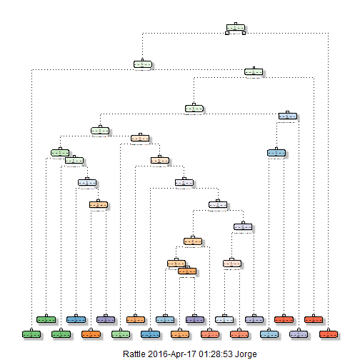
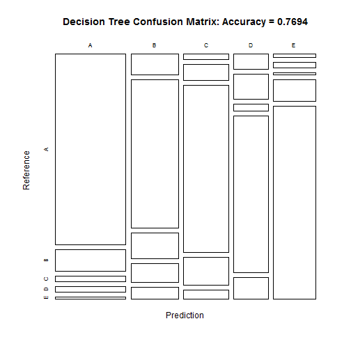
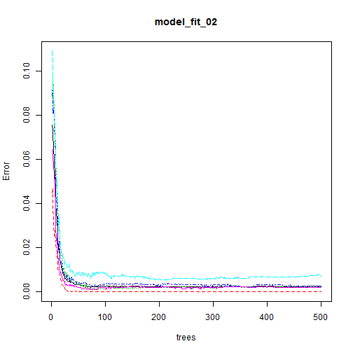
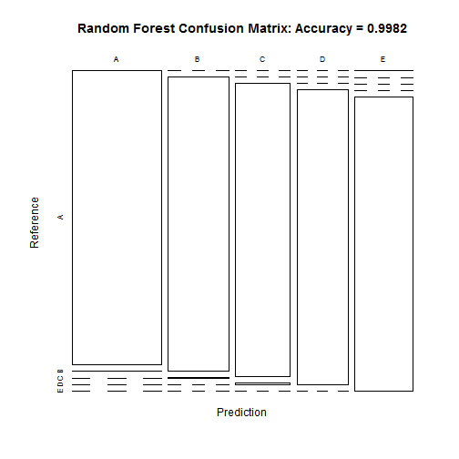

#Introduction

These are the files produced during a homework assignment of Coursera's MOOC Practical Machine Learning from Johns Hopkins University.  
Here is the introduction of the exercise:  
Using devices such as Jawbone Up, Nike FuelBand, and Fitbit it is now possible to collect a large amount of data about personal activity relatively inexpensively. These type of devices are part of the quantified self movement-a group of enthusiasts who take measurements about themselves regularly to improve their health, to find patterns in their behavior, or because they are tech geeks. One thing that people regularly do is quantify how much of a particular activity they do, but they rarely quantify how well they do it. In this project, your goal will be to use data from accelerometers on the belt, forearm, arm, and dumbell of 6 participants. They were asked to perform barbell lifts correctly and incorrectly in 5 different ways. More information is available from the website here: http://groupware.les.inf.puc-rio.br/har (see the section on the Weight Lifting Exercise Dataset).  

##Study Objective:  
The goal of your project is to predict the manner in which they did the exercise. This is the "classe" variable in the training set. You may use any of the other variables to predict with. You should create a report describing how you built your model, how you used cross validation, what you think the expected out of sample error is, and why you made the choices you did. You will also use your prediction model to predict 20 different test cases.  

#Data

The training data for this project are available here: https://d396qusza40orc.cloudfront.net/predmachlearn/pml-training.csv

The test data are available here: https://d396qusza40orc.cloudfront.net/predmachlearn/pml-testing.csv

The data for this project come from this source: http://groupware.les.inf.puc-rio.br/har. If you use the document you create for this class for any purpose please cite them as they have been very generous in allowing their data to be used for this kind of assignment.  

#Getting and loading the data
The training dataset will be used to develop the models and the Testing dataset will be use to verify the accuracy of the models.  

```r
set.seed(555)

URL_training <- "http://d396qusza40orc.cloudfront.net/predmachlearn/pml-training.csv"
URL_testing <- "http://d396qusza40orc.cloudfront.net/predmachlearn/pml-testing.csv"

training_set <- read.csv(url(URL_training), na.strings=c("NA","#DIV/0!",""))
testing_set <- read.csv(url(URL_testing), na.strings=c("NA","#DIV/0!",""))
```

For this study we will need the following R packages:  

```r
library(caret)
library(ggplot2)
library(rpart)
library(rpart.plot)
library(rattle)
library(randomForest)
library(RColorBrewer)
library(knitr)
```

Now we will proceed to split the training set into two, in order to measure the out of sample accuracy of the model.  


```r
inTrain <- createDataPartition(training_set$classe, p=0.75, list=FALSE)
training_part <- training_set[inTrain, ]
testing_part <- training_set[-inTrain, ]
```

#Cleaning and organizing the data

First let's proceed to remove all the variables that have no variability by applying the NearZeroVariance command from the Caret package:  


```r
no_var <- nearZeroVar(training_part, saveMetrics=TRUE)
training_part <- training_part[,no_var$nzv==FALSE]
testing_part <- testing_part[,no_var$nzv==FALSE]
testing_set <- testing_set[,no_var$nzv==FALSE]
```

Clean variables with more than 50% NA


```r
NA_values <- sapply(training_part, function(x) mean(is.na(x))) > 0.5
training_part <- training_part[, NA_values==FALSE]
testing_part <- testing_part[, NA_values==FALSE]
testing_set <- testing_set[, NA_values==FALSE]
```

Remove the non relevant variables (1-5) of the data sets


```r
training_part <- training_part[,-(1:5)]
testing_part <- testing_part[,-(1:5)]
testing_set <- testing_set[,-(1:5)]
```

#Prediction with Decision Trees

```r
set.seed(555)
model_fit_01 <- rpart(classe ~ ., data=training_part, method="class")
fancyRpartPlot(model_fit_01)
```

```
## Warning: labs do not fit even at cex 0.15, there may be some overplotting
```

 

```r
prediction_01 <- predict(model_fit_01, testing_part, type = "class")
cmtree <- confusionMatrix(prediction_01, testing_part$classe)
cmtree
```

```
## Confusion Matrix and Statistics
## 
##           Reference
## Prediction    A    B    C    D    E
##          A 1223  139   35   38   10
##          B   90  642  109   81   51
##          C   22   67  681  113   37
##          D   47   79   22  491   67
##          E   13   22    8   81  736
## 
## Overall Statistics
##                                           
##                Accuracy : 0.7694          
##                  95% CI : (0.7573, 0.7811)
##     No Information Rate : 0.2845          
##     P-Value [Acc > NIR] : < 2.2e-16       
##                                           
##                   Kappa : 0.7078          
##  Mcnemar's Test P-Value : < 2.2e-16       
## 
## Statistics by Class:
## 
##                      Class: A Class: B Class: C Class: D Class: E
## Sensitivity            0.8767   0.6765   0.7965   0.6107   0.8169
## Specificity            0.9367   0.9163   0.9410   0.9476   0.9690
## Pos Pred Value         0.8464   0.6598   0.7402   0.6955   0.8558
## Neg Pred Value         0.9503   0.9219   0.9563   0.9254   0.9592
## Prevalence             0.2845   0.1935   0.1743   0.1639   0.1837
## Detection Rate         0.2494   0.1309   0.1389   0.1001   0.1501
## Detection Prevalence   0.2947   0.1984   0.1876   0.1440   0.1754
## Balanced Accuracy      0.9067   0.7964   0.8687   0.7791   0.8929
```

```r
plot(cmtree$table, col = cmtree$byClass, main = paste("Decision Tree Confusion Matrix: Accuracy =", round(cmtree$overall['Accuracy'], 4)))
```

 

#Prediction with Random Forests


```r
set.seed(555)
model_fit_02 <- randomForest(classe ~ ., data=training_part)
prediction_02 <- predict(model_fit_02, testing_part, type = "class")
cmrf <- confusionMatrix(prediction_02, testing_part$classe)
cmrf
```

```
## Confusion Matrix and Statistics
## 
##           Reference
## Prediction    A    B    C    D    E
##          A 1394    4    0    0    0
##          B    0  945    1    0    0
##          C    0    0  854    3    0
##          D    0    0    0  801    0
##          E    1    0    0    0  901
## 
## Overall Statistics
##                                           
##                Accuracy : 0.9982          
##                  95% CI : (0.9965, 0.9992)
##     No Information Rate : 0.2845          
##     P-Value [Acc > NIR] : < 2.2e-16       
##                                           
##                   Kappa : 0.9977          
##  Mcnemar's Test P-Value : NA              
## 
## Statistics by Class:
## 
##                      Class: A Class: B Class: C Class: D Class: E
## Sensitivity            0.9993   0.9958   0.9988   0.9963   1.0000
## Specificity            0.9989   0.9997   0.9993   1.0000   0.9998
## Pos Pred Value         0.9971   0.9989   0.9965   1.0000   0.9989
## Neg Pred Value         0.9997   0.9990   0.9998   0.9993   1.0000
## Prevalence             0.2845   0.1935   0.1743   0.1639   0.1837
## Detection Rate         0.2843   0.1927   0.1741   0.1633   0.1837
## Detection Prevalence   0.2851   0.1929   0.1748   0.1633   0.1839
## Balanced Accuracy      0.9991   0.9978   0.9990   0.9981   0.9999
```

```r
plot(model_fit_02)
```

 

```r
plot(cmrf$table, col = cmtree$byClass, main = paste("Random Forest Confusion Matrix: Accuracy =", round(cmrf$overall['Accuracy'], 4)))
```

 


#Validation of Prediction Models with Test Dataset

Random Forests gave an Accuracy in the testing_part dataset of 0.9981648, versus an Accuracy of 0.7693719 from the Decision Trees method. what.

The expected out-of-sample error for the Decision Trees is: 0.2306281.  
The expected out-of sample error for the Random Forest is: 0.0018352.  

##Therfore we will proceed to test with the Random Forest Model:  


```r
prediction_test <- predict(model_fit_02, testing_set , type = "class")
prediction_test
```

```
##  1  2  3  4  5  6  7  8  9 10 11 12 13 14 15 16 17 18 19 20 
##  B  A  B  A  A  E  D  B  A  A  B  C  B  A  E  E  A  B  B  B 
## Levels: A B C D E
```
